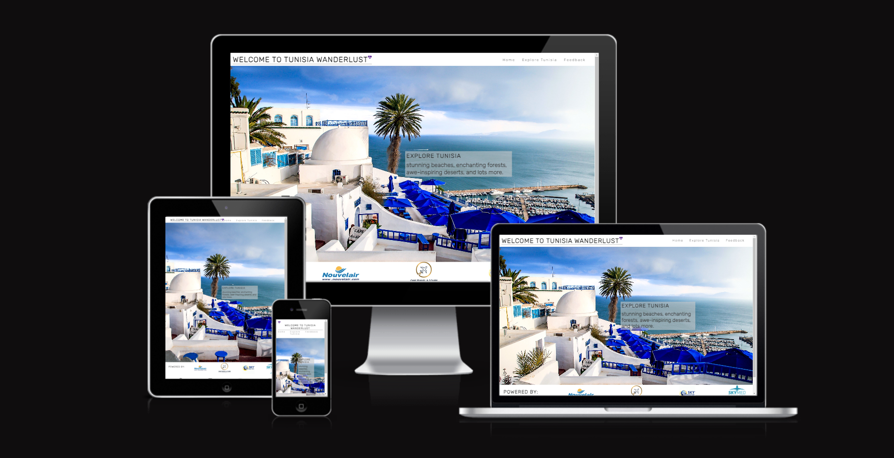
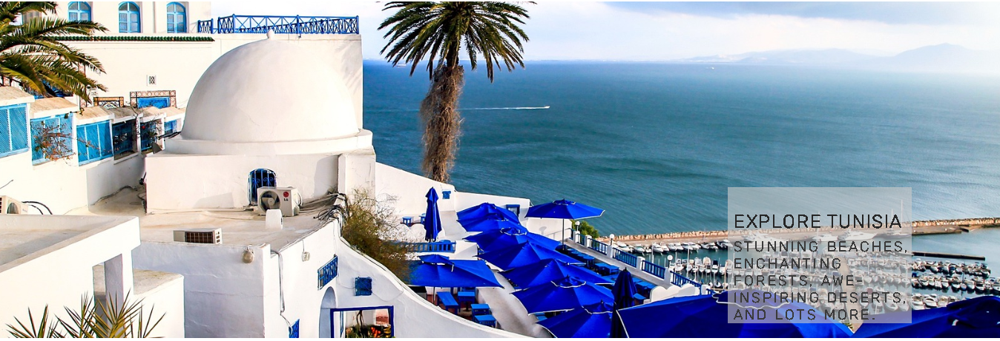
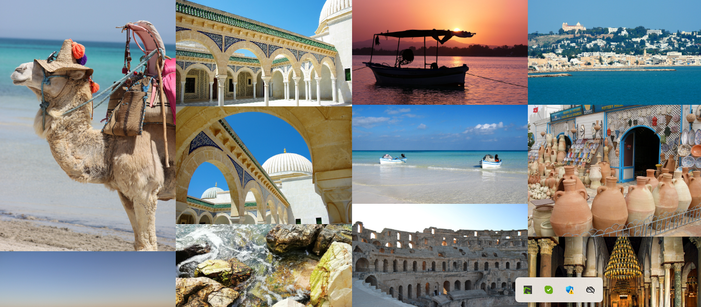
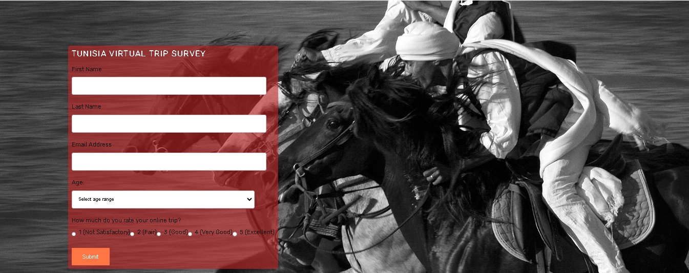

# Tunisia Wanderlust

Welcome to Tunisia Wanderlust, a charming static website that invitations you on a digital adventure to discover the wonders of Tunisia, a enthralling North African vacation spot. This internet site is designed to showcase the diverse landscapes, wealthy culture, and historical landmarks that Tunisia has to offer. Whether you're an avid tourist or virtually curious about this spellbinding country, Tunisia Wanderlust will provide you with a glimpse of its beauty and allure.

## Features

### Existing Features

- __Navigation Bar__

  - Featured on all three pages, the full responsive navigation bar includes links to the Logo, Home page, Explore Tunisia and Feedback page and is identical in each page to allow for easy navigation.
  - This section will allow the user to easily navigate from page to page across all devices without having to revert back to the previous page via the ‘back’ button. 

- __Home Page__

  - The Home web page functions a photograph with a textual content overlay, offering the person with a glimpse of the lovely landscapes they'll be looking through this web site.
  - This section introduces the user to Tunisia Wanderlust with an eye catching animation to grab their attention.

- __Explore Tunisia__

  - **Landscape Showcase:** Immerse yourself inside the natural splendor of Tunisia through a set of captivating photographs showcasing its breathtaking landscapes, such as its lovely sea perspectives, majestic mountains, and wide desert landscapes.

  - **Mosques of Tunisia:** Explore the intricate architecture and cultural significance of Tunisia's mosques, encapsulating the essence of the country's rich spiritual heritage.

- __Feedback Page__

  - **Rate Your Virtual Journey:** Share your enjoy of the digital experience to Tunisia through filling out our feedback form. Let us recognize how lots you loved your on line adventure and what we can do to improve your experience in the future.

- __Footer__

  - **Powered By** This project is proudly powered by our sponsors:

  - **Social Network** You can also follow us and get updates on these social media platforms:

### Features Left to Implement
- Interactive Map: Integrate an interactive map of Tunisia that permits users to explore unique regions, landmarks, and points of interest. Users can click on on map markers to view greater statistics and pix of specific places.

- User Accounts and Profiles: Implement a user account gadget that allows site visitors to create money owed and customise their revel in. Users can shop their favored pix, bookmark destinations, and receive personalized guidelines.

- Language Support: Add help for a couple of languages to cater to a broader target market. Users can pick out their preferred language, and the internet site's content material may be displayed thus.

## Technologies Used

- HTML5
- CSS3

## Testing

Ensuring the capability and usability of the Tunisia Wanderlust internet site is paramount to providing a unbroken and enjoyable revel in for our users. Throughout the development manner, large checking out turned into carried out to guarantee that all capabilities paintings as intended and that the web site plays constantly across numerous browsers and screen sizes.

### Cross-Browser Compatibility:
Tunisia Wanderlust has been examined on foremost web browsers, consisting of Google Chrome, Mozilla Firefox, Microsoft Edge, and Safari. The internet site's format, content, and capability remain consistent across these browsers, handing over a uniform revel in to all users.

### Responsive Design:
Responsive design is a crucial factor in Tunisia Wanderlust, ensuring a seamless person experience throughout diverse devices. One prominent characteristic of the responsive layout is the sticky header, which stays fixed at the pinnacle of the screen, providing easy get admission to to the navigation menu and improving navigation comfort as users scroll down the page. This sticky header is seen at all times, permitting users to explore the website's content material with out losing get right of entry to to crucial navigation options. To make sure premier performance on exceptional gadgets, tremendous checking out became conducted for the duration of the development system. Google Chrome Developer Tools have been applied to emulate various cellular gadgets, together with smartphones and tablets. By using DevTools, the website's responsiveness and layout had been pleasant-tuned to supply an appealing and consumer-pleasant experience across quite a number screen sizes and resolutions.

### Validator Testing 

- HTML
  - No errors were returned when passing through the official [W3C validator](when using direct input)
- CSS
  - No errors were found when passing through the official [(Jigsaw) validator](when using direct input)

### Feature Testing:
Each characteristic of the website become cautiously examined to make sure its easy functioning. Here are the important thing features and their testing outcomes:
*  Explore Tunisia Page: The "Explore Tunisia" web page, containing pics of various landscapes and mosques, became thoroughly examined to ensure that every one photographs load successfully and display correctly on various gadgets.
* Feedback Page: The "Feedback" page with the person survey shape became rigorously examined to validate that customers can put up their rankings and remarks with none troubles. Form validation guarantees that all required fields are filled before submission.

### Unfixed Bugs
- Image Loading Delay: In some instances, customers can also revel in a moderate put off in image loading, specifically whilst having access to the website on slower internet connections. This difficulty can have an effect on the overall person experience and create a belief of sluggish loading times. We are actively exploring photograph optimization techniques to improve loading velocity and offer a smoother surfing enjoy.

### Future Testing
While thorough checking out has been carried out, we apprehend that customers' studies may additionally range. We inspire customers to offer comments and file any problems they come upon, supporting us constantly enhance Tunisia Wanderlust and deal with any unexpected problems right away.

## Credits
- The snap shots used on the "Home" and "Explore Tunisia" web page have been sourced from an open source inventory image website namely Pixabay. The snap shots were carefully chosen to show off Tunisia's numerous landscapes, inclusive of its beautiful sea perspectives, majestic mountains, and great deserts.
- The logos featured within the "Powered By" section were procured from the open-supply logo repository, "Seek Logo."